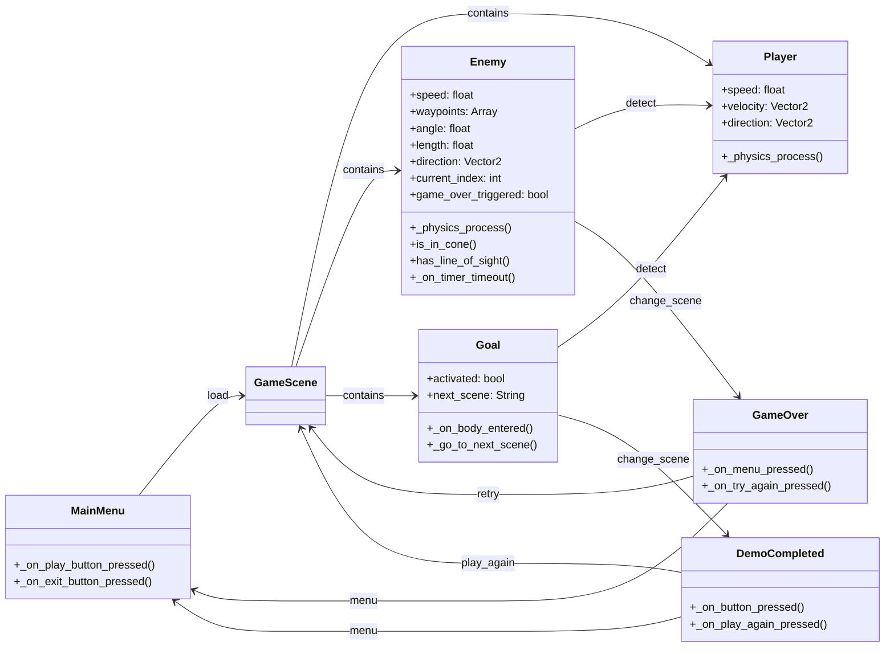

# AST Code & Play

## Descripción del Sistema

El proyecto consiste en el diseño y desarrollo de una plataforma de videojuegos orientada al usuario, que combina un ecosistema de juegos personalizados con una arquitectura que integra recepción de feedback y soporte técnico, permitiendo que la evolución del catálogo sea impulsada directamente por la comunidad.

## Historias de Usuario

| ID   | Nombre                          | Issue  | 
|------|---------------------------------|--------| 
| US-01 | Tutorial didáctico             | [#1](https://github.com/AST-Code-Play/Proyecto-Fundamentos-De-Software/issues/1)   | 
| US-02 | Sistema de compras             | [#2](https://github.com/AST-Code-Play/Proyecto-Fundamentos-De-Software/issues/2)   |
| US-03 | Lista de conexiones y estado   | [#3](https://github.com/AST-Code-Play/Proyecto-Fundamentos-De-Software/issues/3)   |  
| US-04 | Configuración de accesibilidad | [#4](https://github.com/AST-Code-Play/Proyecto-Fundamentos-De-Software/issues/4)   |  
| US-05 | Registro de actividad          | [#5](https://github.com/AST-Code-Play/Proyecto-Fundamentos-De-Software/issues/5)   |  
| US-06 | Ver logros                     | [#6](https://github.com/AST-Code-Play/Proyecto-Fundamentos-De-Software/issues/6)   |  
| US-07 | Evitar pérdida de progreso     | [#7](https://github.com/AST-Code-Play/Proyecto-Fundamentos-De-Software/issues/7)   |  
| US-08 | Precisión de hitboxes          | [#8](https://github.com/AST-Code-Play/Proyecto-Fundamentos-De-Software/issues/8)   |
| US-09 | Visualizar intento previo      | [#9](https://github.com/AST-Code-Play/Proyecto-Fundamentos-De-Software/issues/9)   |  
| US-10 | Contador de intentos           | [#10](https://github.com/AST-Code-Play/Proyecto-Fundamentos-De-Software/issues/10) |  

## Chats con Clarita

|  US  | Link | 
|------|------| 
| 01-04 | https://chatgpt.com/share/6a1e55a3-881c-83e9-8fc5-2760371735d0 |
| 05-08 | https://chatgpt.com/share/6a1e55a7-4cc0-83e9-9261-fc47ff800ee4 |
| 09-10 | https://chatgpt.com/share/6a1e5583-78fc-83e9-b76b-8a7ae85045f6 |

## Requisitos Extrafuncionales

Ver [ReqExtrafuncionales.md](https://github.com/AST-Code-Play/Proyecto-Fundamentos-De-Software/blob/main/ReqExtrafuncionales.md)

## Entidades del Dominio

## Mockups

| Mockup | Historia de usuario relacionada | 
|--------|----------------------------------| 
| [Prototipo en Figma](https://www.figma.com/design/bwICFC1WD77lRQX0Z2WnyY/Splinter-Gear-Liquid-X?node-id=0-1&p=f&t=U9F0MKpkNRh91lEm-0) | US-01 al US-10 |

Ver [Archivo ZIP del juego](https://drive.google.com/file/d/1vOnuNOZdk9rHsPeoO6IZqY0eES7on1QN/view)

## Diseño Arquitectónico

Ver [Arquitectura.md](https://github.com/AST-Code-Play/Proyecto-Fundamentos-De-Software/blob/main/Arquitectura.md)

## Responsabilidades del equipo 

| Integrante | Rol | Ítems de la rúbrica a cargo | 
|------------|-----|----------------------------| 
| Martín Loyola | Product Owner | 2.3 Mockups, 2.4 Entidades del dominio | 
| Jesús Carvajal | Scrum Master  | 1.1 Historias de Usuario, 2.4 Entidades del dominio |
| Cristobal Cartagena | Developer | 1.1 Historias de Usuario, 1.2 Diseño de requerimientos, 2.2 Diseño arquitectonico |
| Bruno Mora | Developer | 1.1 Historias de Usuario, 1.2 Diseño de requerimientos, 2.4 Entidades del dominio  |
| Jesús Cortés | Developer | 1.1 Historias de Usuario, 2.2 Diseño arquitectonico |

